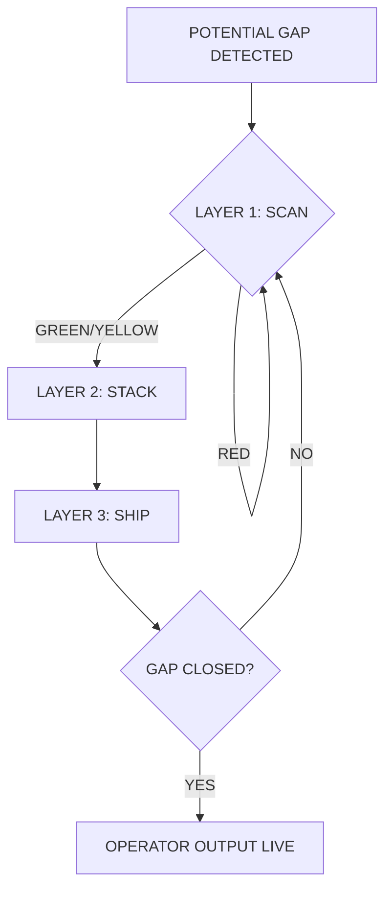

```
╔══════════════════════════════════════════════════════════════╗
║  ▓▓▓ THREE-LAYER PROCESS // HUMAN OS PIPELINE ▓▓▓            ║
║  REPLACES: amygdala-room spiel // STATUS: OPERATOR-READY       ║
╚══════════════════════════════════════════════════════════════╝
```

# Three-Layered Operator Process

> The old amygdala-room framing was accurate but heavy. This stack lands cleaner: **scan → stack → ship**.

---

## Why This Replaces the Amygdala Room

The amygdala-room model was right about nervous-system gating — but it read like trauma jargon to operators who just needed a **boot sequence**. This process keeps the biology, drops the theater:

| Old frame | New frame |
|-----------|-----------|
| "Go to the amygdala room" | **LAYER 1: SCAN** — read your state before you act |
| Scattered wellness + school vibes | **LAYER 2: STACK** — trades + wellness + models, stealth-loaded |
| Potential without output | **LAYER 3: SHIP** — proof of work closes the gap |

---

## LAYER 1 — SCAN

**Read the Human OS before you commit resources.**

```
┌─ SCAN CHECKLIST ─────────────────────────────────────────────┐
│  □ Body signal      — sleep, fuel, movement, pain            │
│  □ State signal     — calm / activated / shutdown          │
│  □ Gap signal       — "potential ≠ application" — name it    │
│  □ Environment      — clinic, shop, home, screen           │
└──────────────────────────────────────────────────────────────┘
```

**Operator rule:** No stacking or shipping on a bad scan. Calibrate first. Thirty seconds beats three hours of misfired effort.

**Outputs:** State tag · Blocker named · Green / yellow / red light for next layer

---

## LAYER 2 — STACK

**Load capability without school-feel.**

Stealth education: trades + wellness + mental models absorbed through **doing**, not lectures.

```
┌─ STACK SOURCES ──────────────────────────────────────────────┐
│  TRADES        — hands-on skill, tangible output             │
│  WELLNESS      — nervous system as infrastructure, not spa   │
│  MENTAL MODELS — maps for paradox, 2e, high-IQ wiring        │
└──────────────────────────────────────────────────────────────┘
```

**Paradox Society integration:** EHR + physical clinics as learning spaces — the stack loads in the room where life already happens.

**Outputs:** One model loaded · One skill rep · One wellness anchor installed

---

## LAYER 3 — SHIP

**Apply yourself. Close the potential gap.**

```
┌─ SHIP PROTOCOL ──────────────────────────────────────────────┐
│  1. Define the smallest proof-of-work unit                   │
│  2. Execute before optimizing                                │
│  3. Log output (issue, commit, field note, artifact)         │
│  4. Retro: did the stack hold? adjust scan or load           │
└──────────────────────────────────────────────────────────────┘
```

**Operator rule:** Motivation is not a layer. Shipping is.

**Outputs:** Artifact shipped · Gap narrowed · Next scan scheduled

---

## Pipeline Flow



---

## Book Mapping

| Layer | High-Operator | Little-Op | Parent |
|-------|---------------|-----------|--------|
| **SCAN** | Operator self-audit | Kid state check | Household pulse |
| **STACK** | Trades + elite models | 2e-friendly reps | Parent stack design |
| **SHIP** | Proof of work | Kiddo field test | Family ship cadence |

---

## Field Use

1. Run SCAN before any session (clinic, shop, homework, build).
2. STACK only what the scan supports — one layer deep, not ten tabs open.
3. SHIP something small same-day. Log it in the relevant book folder.

**Embrace the paradox. The map and the rope are the same object.**